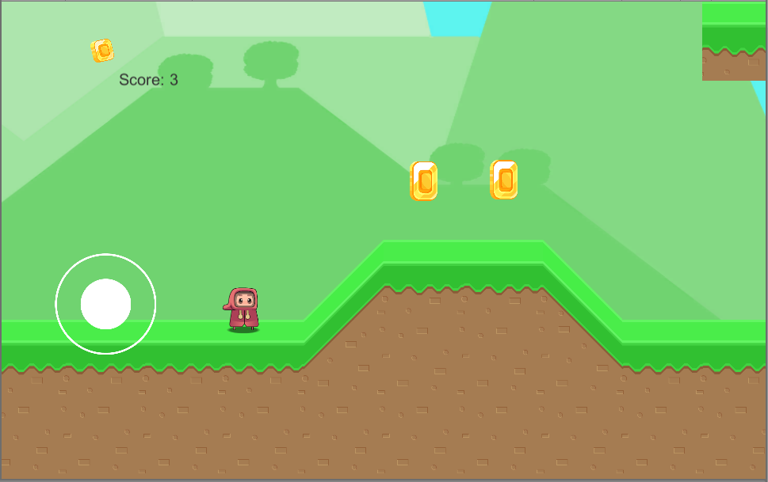

# CoinKing  
 

Kratka igrca, za mobilno napravo, v kateri s karakterjem premaguješ ovire, zbiraš žetone in z njimi trguješ v trgovini.

### Diagram primera uporabe

 
 
 Rezultat je viden v igri, med igranjom. Rezultat je tudi prenosljiv iz nivoja v nivo, ampak po trku z oviro se rezultat znova nastavi na 0 in se začne isti nivo od začetka. Prijava do določene mere ni potrebna saj se rezultat shranjuje na naši igralski platformi.

### E-R diagram 

  
  
  V naši končni verziji je število žetonov tudi enako končnemu rezultatu.

### Slike grafičnega vmesnika

 

Na menuju imamo 3 opcije. Po izbiri Play se nam začne igra. Če gremo na Shop nas preusmeri na vmesnik kjer lahko vidimo skine, ki bodo na voljo za nakup (work in progress). Na koncu pa še imamo Quit Game, ki nam zapre igro, ko hočemo prenehat igrat.

