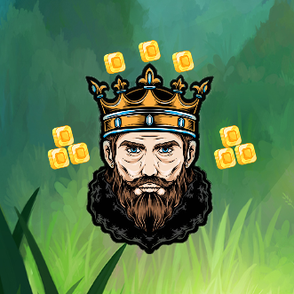
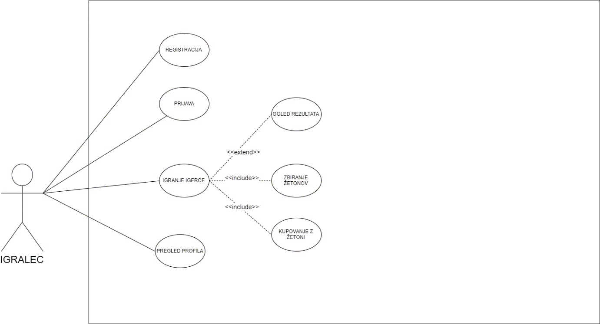
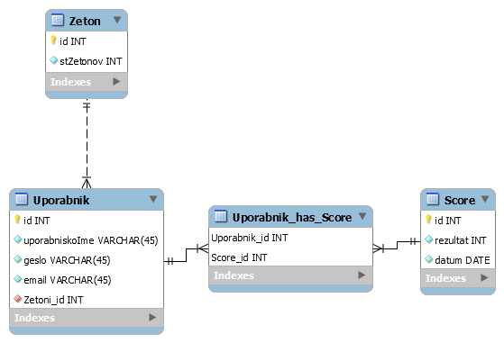
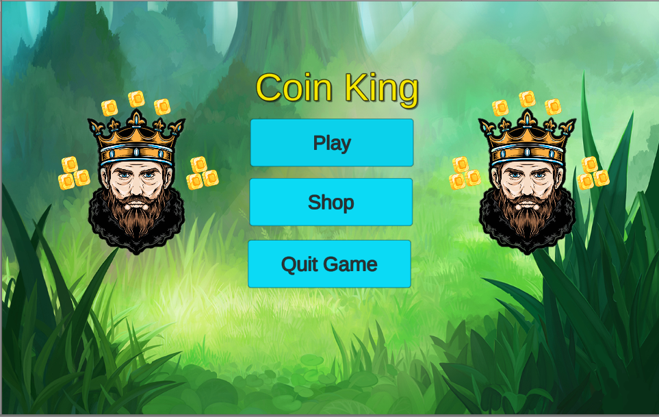
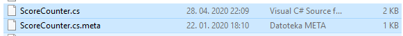
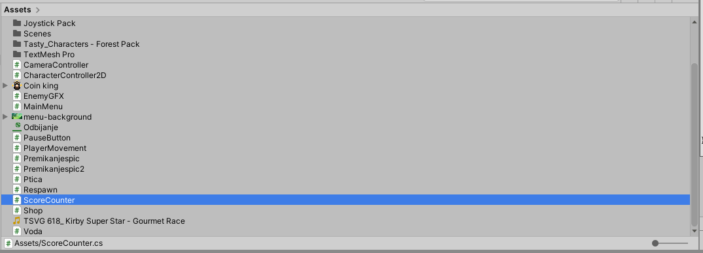
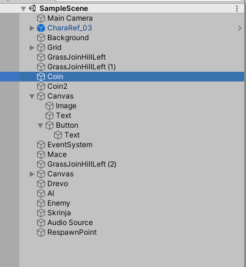
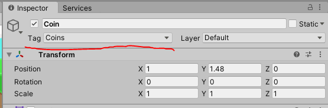
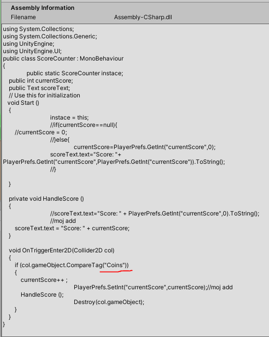
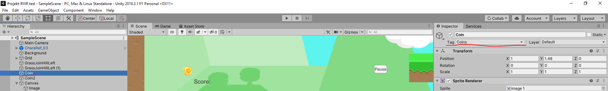

# CoinKing  

Kratka igrca, za mobilno napravo, v kateri s karakterjem premaguješ ovire, zbiraš žetone in z njimi trguješ v trgovini.

### Diagram primera uporabe

 
 
 Rezultat je viden v igri, med igranjom. Rezultat je tudi prenosljiv iz nivoja v nivo, ampak po trku z oviro se rezultat znova nastavi na 0 in se začne isti nivo od začetka. Prijava do določene mere ni potrebna saj se rezultat shranjuje na naši igralski platformi.

### E-R diagram 

  
  
  V naši končni verziji je število žetonov tudi enako končnemu rezultatu.

### Slike grafičnega vmesnika

 

Na menuju imamo 3 opcije. Po izbiri Play se nam začne igra. Če gremo na Shop nas preusmeri na vmesnik kjer lahko vidimo skine, ki bodo na voljo za nakup (work in progress). Na koncu pa še imamo Quit Game, ki nam zapre igro, ko hočemo prenehat igrat.

### Vodič za implementacijo kode, ki prenaša točke iz enega nivoja v drugega

Prvo moramo dodat datoteko iz našega projekta v vašega. Datoteko oziroma skripto, ki je potrebno dodat je ScoreCounter.cs (lahko tudi skupaj z ScoreCounter.cs.meta.).

Te datoteke dodate med vaše assests tako da se vam prikaže na tak način: 

Ko se vam prikaže skripta kot je prikazana na zgornji sliki potem morate samo še dodat tag na vašem objektu s katerem po trku želite, da se beležijo točke.
Se pravi prvo greste v SampleScenu na objekt katerega želite beležit (v našem primeru coin 1 in coin 2).

Ko izberemo objekt katerega želimo beležit z skripto mu nastavimo tag Coins.

Seveda pa lahko tudi tag spremenimo v kar koli drugega in v kodi tudi spremenimo pričakovani tag (v našem primeru je "Coins").
Gremo v ScoreCounter.cs in spremenimo if stavek kjer pričakuje tag Coins na isti tag kot smo prej si zamislili.

Kadar naredimo kot je zgoraj omenjeno nam mora na koncu igledati na tak način:

